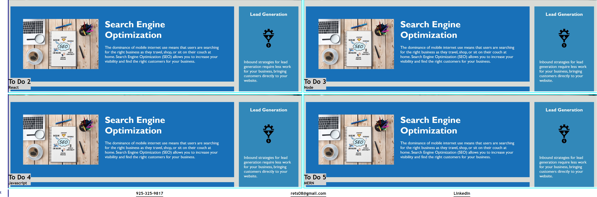

# Richard-Thomas-Professional-Portfolio

## Description

Create a professional portfolio, so that employers can view my projects, read about my professional background, and view my professional background. The project will demonstrate the use of CSS variables, media queries, and flexbox.

## Installation

N/A

## Usage

The user should be able to navigate to the sections for About Me, projects, and contact information. The page is responsive for different media devices or screen sizes. Projects are linked to deployed GitHub projects. Clicking on the resume menu item will download my current resume. The link to my project is:
https://rethomas67.github.io/Richard-Thomas-Professional-Portfolio.

Images of the project:

## Credits

N/A

## License

N/A
